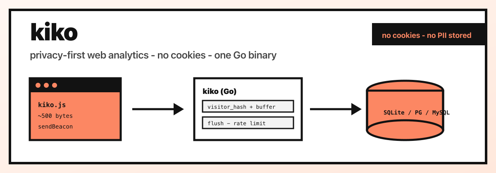
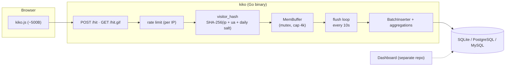

# kiko — Privacy-first web analytics

<a id="top"></a>

<p align="center">
  <strong>📊</strong> <em>Collect page views without cookies</em>
</p>

[](https://github.com/hrodrig/kiko/releases)
[](https://github.com/hrodrig/kiko/releases)
[](https://github.com/hrodrig/kiko/actions)
[](https://github.com/hrodrig/kiko/actions/workflows/security.yml)
[](https://github.com/hrodrig/kiko/actions/workflows/codeql.yml)
[](https://codecov.io/gh/hrodrig/kiko)
[](https://gghstats.hermesrodriguez.com/hrodrig/kiko)
[](https://go.dev/)
[](https://opensource.org/licenses/MIT)
[](https://pkg.go.dev/github.com/hrodrig/kiko)
[](https://goreportcard.com/report/github.com/hrodrig/kiko)
[](https://deps.dev/go/github.com/hrodrig/kiko)

**Repo:** [github.com/hrodrig/kiko](https://github.com/hrodrig/kiko) · **Releases:** [Releases](https://github.com/hrodrig/kiko/releases)

> **Early development:** kiko is in initial active development. Expect breaking changes, incomplete features, and data loss between releases. **Do not use in production.**



Privacy-first web analytics **collector** in Go. A ~500-byte tracking script sends page views; the server hashes visitors without cookies, buffers hits in memory, and flushes batch inserts plus hourly aggregations to **SQLite** (default), **PostgreSQL**, or **MySQL**. Dashboard is a separate repo.

**Self-hosted deployment (Docker Compose, Helm, Kubernetes manifests):** **[kiko-selfhosted](https://github.com/hrodrig/kiko-selfhosted)** — production paths and example stacks live there; this repo ships the application binary, packages, and container image only (same split as [pgwd](https://github.com/hrodrig/pgwd) / [pgwd-selfhosted](https://github.com/hrodrig/pgwd-selfhosted)).

**GitHub repo traffic (history beyond 14 days):** sibling tool **[gghstats](https://github.com/hrodrig/gghstats)** — [live stats for kiko](https://gghstats.hermesrodriguez.com/hrodrig/kiko) (clone badge above).

**Documentation:** [SPECIFICATIONS.md](SPECIFICATIONS.md) (architecture, schema, API), [ROADMAP.md](ROADMAP.md) (phases), `configs/kiko.yml.sample`, and `man kiko` (when packaged).

**Brand assets:** hero banner [`assets/kiko-hero.png`](assets/kiko-hero.png) (source SVG alongside); favicons under [`assets/favicons/`](assets/favicons/) (`favicon.svg` + PNG/ICO + `manifest.json` for the future dashboard). The collector API does not serve these yet.

## Table of contents

- [Quick start](#quick-start)
- [Why kiko](#why-kiko)
- [How it works](#how-it-works)
- [Configuration](#configuration)
- [Install](#install)
- [Tracking snippet](#tracking-snippet)
- [API](#api)
- [Quality gates](#quality-gates)
- [Related](#related)
- [Get involved](#get-involved)
- [Star History](#star-history)
- [License](#license)

---

## Quick start

```bash
git clone https://github.com/hrodrig/kiko
cd kiko
make build
./kiko serve
```

Add to your site HTML (replace the host with your public kiko URL):

```html
<script defer src="https://analytics.yourdomain.com/kiko.js"></script>
```

Custom config:

```bash
kiko serve -c /etc/kiko/kiko.yml
```

Probes for Kubernetes: `GET /api/v1/healthz` (liveness), `GET /api/v1/readyz` (readiness — DB + buffer).

[↑ Back to top](#top)

---

## Why kiko

- **No cookies** — SHA-256 visitor hash with daily salt. No GDPR banner needed.
- **No Node in production** — tracking script is ~500 bytes JS. Server is a static Go binary.
- **Passes audits** — govulncheck, grype, gocyclo, cover. Same standard as sibling projects.
- **Single binary** — Go, CGO disabled, distroless. ~2.5MB compiled.
- **Multi-database** — SQLite zero-config default; Postgres and MySQL via config.

[↑ Back to top](#top)

---

## How it works



Each hit is validated, hashed, and appended to an in-memory buffer (mutex-protected; drops when full). Every 10s the buffer flushes to the database in batch: raw hits, normalized paths/referrers, and hourly counts. Rate limiting uses a per-IP token bucket (pattern from [gghstats](https://github.com/hrodrig/gghstats)).

[↑ Back to top](#top)

---

## Configuration

Config file: `kiko.yml` (see [configs/kiko.yml.sample](configs/kiko.yml.sample)). All fields overridable via env vars with `KIKO_` prefix.

```yaml
listen: ":8080"
public_url: "https://analytics.yourdomain.com"
log_level: info

database:
  driver: sqlite          # sqlite | postgres | mysql
  path: ./data/kiko.db    # sqlite only

buffer:
  flush_interval: 10      # seconds between batch flushes
  capacity: 4096          # max hits in memory before drop

rate_limit:
  enabled: true
  requests_per_sec: 100
  burst: 200

allowed_hosts: []         # empty = accept all

visitor:
  salt: ""                # set in production (KIKO_VISITOR_SALT)
```

| Env | Maps to |
|-----|---------|
| `KIKO_LISTEN` | `listen` |
| `KIKO_PUBLIC_URL` | `public_url` |
| `KIKO_LOG_LEVEL` | `log_level` |
| `KIKO_DATABASE_DRIVER` | `database.driver` |
| `KIKO_DATABASE_PATH` | `database.path` |
| `KIKO_DATABASE_HOST` | `database.host` |
| `KIKO_DATABASE_PORT` | `database.port` |
| `KIKO_DATABASE_USER` | `database.user` |
| `KIKO_DATABASE_PASSWORD` | `database.password` |
| `KIKO_DATABASE_DBNAME` | `database.dbname` |
| `KIKO_DATABASE_SSLMODE` | `database.sslmode` |
| `KIKO_DATABASE_DSN` | `database.dsn` (overrides all) |
| `KIKO_BUFFER_FLUSH_INTERVAL` | `buffer.flush_interval` |
| `KIKO_BUFFER_CAPACITY` | `buffer.capacity` |
| `KIKO_RATE_LIMIT_ENABLED` | `rate_limit.enabled` |
| `KIKO_RATE_LIMIT_REQUESTS_PER_SEC` | `rate_limit.requests_per_sec` |
| `KIKO_RATE_LIMIT_BURST` | `rate_limit.burst` |
| `KIKO_ALLOWED_HOSTS` | `allowed_hosts` (comma-separated) |
| `KIKO_VISITOR_SALT` | `visitor.salt` |

### Log levels

| Level | Value | Description |
|-------|-------|-------------|
| trace | 0 | Diagnostic detail, most verbose |
| debug | 1 | Debugging information |
| info | 2 | General operational messages (default) |
| warn | 3 | Non-critical issues |
| error | 4 | Runtime errors |
| fatal | 5 | Critical failure, process exits |
| off | 6 | Nothing logged |

[↑ Back to top](#top)

---

## Install

```bash
# From source (recommended during early development)
git clone https://github.com/hrodrig/kiko
cd kiko
make build
sudo cp kiko /usr/local/bin/

# Homebrew (coming soon)
# brew install hrodrig/kiko/kiko

# Docker (when published)
docker pull ghcr.io/hrodrig/kiko:latest
```

| OS | Arch | Format |
|----|------|--------|
| Linux | amd64, arm64 | tar.gz, .deb, .rpm, Docker |
| macOS | amd64, arm64 | tar.gz, Homebrew |
| Windows | amd64, arm64 | zip |
| FreeBSD | amd64, arm64 | tar.gz, port |
| OpenBSD | amd64, arm64 | tar.gz, port |

[↑ Back to top](#top)

---

## Tracking snippet

The server embeds `kiko.js` (~500B). It sends `POST /hit` via `navigator.sendBeacon()` and falls back to a 1×1 GIF pixel (`GET /hit.gif`) when needed. Always responds with a transparent GIF — success and rejection look the same to the browser.

[↑ Back to top](#top)

---

## API

| Endpoint | Method | Description |
|----------|--------|-------------|
| `/kiko.js` | GET | Tracking script (cached 24h) |
| `/hit` | POST | JSON tracking endpoint |
| `/hit.gif` | GET | Pixel fallback |
| `/api/v1/healthz` | GET | Liveness probe |
| `/api/v1/readyz` | GET | Readiness probe (DB + buffer) |

Query API for dashboards is planned in Phase 2 — see [ROADMAP.md](ROADMAP.md).

[↑ Back to top](#top)

---

## Quality gates

| Gate | Threshold | Enforced |
|------|-----------|----------|
| gofmt -s | No diff | CI + release |
| go vet | 0 warnings | CI + release |
| gocyclo | ≤ 14 | CI + release |
| govulncheck | 0 vulnerabilities | CI + release |
| grype | 0 high/critical | CI + release |
| go test -cover | ≥ 80% | CI + release |
| CodeQL | Clean | CI |

Local check: `make release-check`

[↑ Back to top](#top)

---

## Related

| Project | Role |
|---------|------|
| [kiko-selfhosted](https://github.com/hrodrig/kiko-selfhosted) | Docker Compose, Helm, K8s manifests |
| [gghstats](https://github.com/hrodrig/gghstats) | GitHub traffic stats |
| [pgwd](https://github.com/hrodrig/pgwd) | PostgreSQL connection watchdog |
| [kzero](https://github.com/hrodrig/kzero) | Kubernetes pipeline CLI |
| [groot](https://github.com/hrodrig/groot) | Kubernetes log collector |

[↑ Back to top](#top)

---

## Get involved

Found kiko useful? You can:

- **Report bugs** or **suggest features** — [open an issue](https://github.com/hrodrig/kiko/issues)
- **Contribute code** — see [CONTRIBUTING.md](CONTRIBUTING.md)
- **Star the repo** — it helps others discover kiko

[↑ Back to top](#top)

---

## Star History

[](https://www.star-history.com/?repos=hrodrig%2Fkiko&type=date&legend=bottom-right)

[↑ Back to top](#top)

---

## License

MIT — [LICENSE](LICENSE)

[↑ Back to top](#top)
