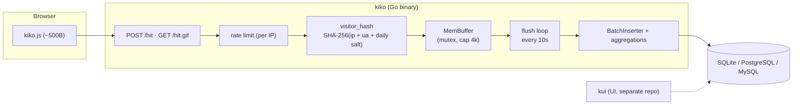

# kiko — Privacy-first web analytics collector in Go

<a id="top"></a>

<p align="center">
  <em>High-performance, cookie-free, batteries-included server-side analytics.</em>
</p>

[](https://github.com/hrodrig/kiko/releases)
[](https://github.com/hrodrig/kiko/releases)
[](https://github.com/hrodrig/kiko/actions)
[](https://github.com/hrodrig/kiko/actions/workflows/security.yml)
[](https://github.com/hrodrig/kiko/actions/workflows/codeql.yml)
[](https://codecov.io/gh/hrodrig/kiko)
[](https://gghstats.hermesrodriguez.com/hrodrig/kiko)
[](https://go.dev/)
[](https://opensource.org/licenses/MIT)
[](https://pkg.go.dev/github.com/hrodrig/kiko)
[](https://goreportcard.com/report/github.com/hrodrig/kiko)
[](https://deps.dev/go/github.com/hrodrig/kiko)

**Repo:** [github.com/hrodrig/kiko](https://github.com/hrodrig/kiko) · **Releases:** [Releases](https://github.com/hrodrig/kiko/releases)

> **Early development:** kiko is in initial active development. Expect breaking changes, incomplete features, and data loss between releases. **Do not use in production.**


Privacy-first web analytics **collector** in Go. A ~500-byte tracking script sends inbound page views; the server hashes visitors without cookies, buffers hits in memory, and flushes sorted batch inserts plus hourly aggregations to **SQLite** (default), **PostgreSQL**, or **MySQL**.

**This repo is kiko — collection only.** **[kui](https://github.com/hrodrig/kui)** (*kiko* + *ui*) is the analytics **user interface** in a separate repo: charts, tables, and reports over kiko's query API. kui is not built yet; the hero window on the right is where kui will sit.

**Self-hosted deployment (Docker Compose, Helm, Kubernetes manifests):** **[kiko-selfhosted](https://github.com/hrodrig/kiko-selfhosted)** — production paths and example stacks live there; this repo ships the application binary, packages, and container image only (same split as [pgwd](https://github.com/hrodrig/pgwd) / [pgwd-selfhosted](https://github.com/hrodrig/pgwd-selfhosted)).

**GitHub repo traffic (history beyond 14 days):** sibling tool **[gghstats](https://github.com/hrodrig/gghstats)** — [live stats for kiko](https://gghstats.hermesrodriguez.com/hrodrig/kiko) (clone badge above).

**Documentation:** [SPECIFICATIONS.md](SPECIFICATIONS.md) (architecture, schema, API), [ROADMAP.md](ROADMAP.md) (phases), `configs/kiko.yml.sample`, and `man kiko` (when packaged).

**Brand assets:** hero banner [`assets/kiko-hero-full.png`](assets/kiko-hero-full.png) (compact [`assets/kiko-hero.png`](assets/kiko-hero.png) + source [`assets/kiko-hero.svg`](assets/kiko-hero.svg)); favicons under [`assets/favicons/`](assets/favicons/) (`favicon.svg` + PNG/ICO + `manifest.json` for future **kui**). The collector API does not serve these yet.

## Table of contents

- [Quick start](#quick-start)
- [Why kiko](#why-kiko)
- [Design principles](#design-principles)
- [How it works](#how-it-works)
- [Configuration](#configuration)
- [Build & releases](#build--releases)
- [Tracking snippet](#tracking-snippet)
- [API](#api)
  - [Hit payload](#hit-payload)
- [Quality gates](#quality-gates)
- [Related](#related)
- [Get involved](#get-involved)
- [Star History](#star-history)
- [License](#license)

---

## Quick start

```bash
git clone https://github.com/hrodrig/kiko
cd kiko
make build
./kiko serve
```

Add to your site HTML (replace the host with your public kiko URL):

```html
<script defer src="https://analytics.yourdomain.com/kiko.js"></script>
```

Custom config:

```bash
kiko serve -c /etc/kiko/kiko.yml
```

Probes for Kubernetes: `GET /api/v1/healthz` (liveness), `GET /api/v1/readyz` (readiness — DB + buffer). **Deployment paths** (Compose, Helm, MicroK8s): **[kiko-selfhosted](https://github.com/hrodrig/kiko-selfhosted)**.

[↑ Back to top](#top)

---

## Why kiko

- **No cookies** — SHA-256 visitor hash with daily salt. No GDPR banner needed.
- **Batteries included** — ~500B tracking script, in-memory buffer, batch flush, migrations, and health probes in one static binary.
- **No Node in production** — tracking script is ~500 bytes JS. Server is a static Go binary.
- **Passes audits** — govulncheck, grype, gocyclo, cover. Same standard as sibling projects.
- **Single binary** — Go, CGO disabled, distroless. ~2.5MB compiled.
- **Multi-database** — SQLite zero-config default; Postgres and MySQL via config.

[↑ Back to top](#top)

---

## Design principles

The hero diagram is the product thesis in one glance: a Go collector built to do **one job** — gather web analytics on infrastructure you control, without turning visitors into tracking targets.

**Light and fast.** A ~500-byte tracking script feeds a compact Go binary tuned for throughput. Inbound hits are validated and hashed quickly; there is no heavyweight client SDK and no JavaScript runtime on the server — just a small static binary that chews through traffic like focused industrial gear.

**Privacy by default.** The whole pipeline sits inside a cookie-free boundary. Visitors become ephemeral daily hashes, not persistent profiles; IP addresses stay in memory and never reach disk. Measurement without surveillance — analytics you own, not cross-site fingerprinting.

**Buffer, then batch.** Hits accumulate in a visible in-memory buffer first. On a fixed interval they are sorted, aggregated, and flushed as organized batch inserts plus hourly rollups — the ordered blocks in the diagram. Hot path stays simple; database work stays predictable.

**Your database, your choice.** One collector, three backends: **SQLite** (zero-config default), **PostgreSQL**, or **MySQL**. Same schema and flush logic — pick the engine that fits your stack without forking the application.

That focus — fast ingestion, respectful privacy, smart batching, portable storage — is what kiko is for: a robust Go backend dedicated to collecting analytics **sovereignly and respectfully**. **kui** (*kiko* + *ui*) handles the UI in a separate project; kiko does not ship charts or admin screens.

[↑ Back to top](#top)

---

## How it works

The hero diagram maps this pipeline end to end: inbound raw data from the browser, buffered hits in the Go collector, sorted and aggregated batch writes, then SQLite / PostgreSQL / MySQL — read by **kui** (the UI, separate repo, future).



Each hit is validated, hashed, and appended to an in-memory buffer (mutex-protected; drops when full). Every 10s the buffer flushes to the database in batch: raw hits, normalized paths/referrers, and hourly counts. Rate limiting uses a per-IP token bucket (pattern from [gghstats](https://github.com/hrodrig/gghstats)).

[↑ Back to top](#top)

---

## Configuration

Config file: `kiko.yml` (see [configs/kiko.yml.sample](configs/kiko.yml.sample)). All fields overridable via env vars with `KIKO_` prefix.

```yaml
listen: ":8080"
public_url: "https://analytics.yourdomain.com"
log_level: info

database:
  driver: sqlite          # sqlite | postgres | mysql
  path: ./data/kiko.db    # sqlite only

buffer:
  flush_interval: 10      # seconds between batch flushes
  capacity: 4096          # max hits in memory before drop

rate_limit:
  enabled: true
  requests_per_sec: 100
  burst: 200
  host_requests_per_sec: 50   # optional per-host ingest cap
  host_burst: 100

filter:
  trust_proxy: false          # use first public IP from X-Forwarded-For / X-Real-IP
  block_bots: true
  block_prefetch: true
  block_referrer_spam: true
  block_datacenter_ips: false
  ignore_ips: []              # never count these client IPs
  extra_datacenter_cidrs: []

allowed_hosts: []         # empty = accept all

visitor:
  salt: ""                # set in production (KIKO_VISITOR_SALT)
```

| Env | Maps to |
|-----|---------|
| `KIKO_LISTEN` | `listen` |
| `KIKO_PUBLIC_URL` | `public_url` |
| `KIKO_LOG_LEVEL` | `log_level` |
| `KIKO_DATABASE_DRIVER` | `database.driver` |
| `KIKO_DATABASE_PATH` | `database.path` |
| `KIKO_DATABASE_HOST` | `database.host` |
| `KIKO_DATABASE_PORT` | `database.port` |
| `KIKO_DATABASE_USER` | `database.user` |
| `KIKO_DATABASE_PASSWORD` | `database.password` |
| `KIKO_DATABASE_DBNAME` | `database.dbname` |
| `KIKO_DATABASE_SSLMODE` | `database.sslmode` |
| `KIKO_DATABASE_DSN` | `database.dsn` (overrides all) |
| `KIKO_BUFFER_FLUSH_INTERVAL` | `buffer.flush_interval` |
| `KIKO_BUFFER_CAPACITY` | `buffer.capacity` |
| `KIKO_RATE_LIMIT_ENABLED` | `rate_limit.enabled` |
| `KIKO_RATE_LIMIT_REQUESTS_PER_SEC` | `rate_limit.requests_per_sec` |
| `KIKO_RATE_LIMIT_BURST` | `rate_limit.burst` |
| `KIKO_RATE_LIMIT_HOST_REQUESTS_PER_SEC` | `rate_limit.host_requests_per_sec` |
| `KIKO_RATE_LIMIT_HOST_BURST` | `rate_limit.host_burst` |
| `KIKO_FILTER_TRUST_PROXY` | `filter.trust_proxy` |
| `KIKO_FILTER_BLOCK_BOTS` | `filter.block_bots` |
| `KIKO_FILTER_BLOCK_PREFETCH` | `filter.block_prefetch` |
| `KIKO_FILTER_BLOCK_REFERRER_SPAM` | `filter.block_referrer_spam` |
| `KIKO_FILTER_BLOCK_DATACENTER_IPS` | `filter.block_datacenter_ips` |
| `KIKO_ALLOWED_HOSTS` | `allowed_hosts` (comma-separated) |
| `KIKO_VISITOR_SALT` | `visitor.salt` |

### Log levels

| Level | Value | Description |
|-------|-------|-------------|
| trace | 0 | Diagnostic detail, most verbose |
| debug | 1 | Debugging information |
| info | 2 | General operational messages (default) |
| warn | 3 | Non-critical issues |
| error | 4 | Runtime errors |
| fatal | 5 | Critical failure, process exits |
| off | 6 | Nothing logged |

[↑ Back to top](#top)

---

## Build & releases

**Development** (this repo):

```bash
make build
sudo cp kiko /usr/local/bin/   # optional
```

**Production deployment** (Compose, Helm, Kubernetes, env layout): **[kiko-selfhosted](https://github.com/hrodrig/kiko-selfhosted)** — not this repo.

**Published artifacts:** [GitHub Releases](https://github.com/hrodrig/kiko/releases) and **`ghcr.io/hrodrig/kiko`** (multi-arch). Formats below are built by CI/Goreleaser from this repo; runbooks live in **kiko-selfhosted**.

| OS | Arch | Format |
|----|------|--------|
| Linux | amd64, arm64 | tar.gz, .deb, .rpm, Docker |
| macOS | amd64, arm64 | tar.gz, Homebrew |
| Windows | amd64, arm64 | zip |
| FreeBSD | amd64, arm64 | tar.gz, port |
| OpenBSD | amd64, arm64 | tar.gz, port |

[↑ Back to top](#top)

---

## Tracking snippet

The server embeds `kiko.js` (~500B). It sends `POST /hit` via `navigator.sendBeacon()` and falls back to a 1×1 GIF pixel (`GET /hit.gif`) when needed. Always responds with a transparent GIF — success and rejection look the same to the browser.

**SPAs:** pageviews fire on `history.pushState` / `popstate` (History API). For hash-based routers, load with `?hash=1` to also track `hashchange`.

[↑ Back to top](#top)

---

## API

| Endpoint | Method | Description |
|----------|--------|-------------|
| `/kiko.js` | GET | Tracking script (cached 24h) |
| `/hit` | POST | JSON tracking endpoint |
| `/hit.gif` | GET | Pixel fallback |
| `/api/v1/healthz` | GET | Liveness probe |
| `/api/v1/readyz` | GET | Readiness probe (DB + buffer) |
| `/api/v1/version` | GET | Build metadata — same fields as `kiko version` (public, no auth) |
| `/api/v1/stats/summary` | GET | Headline metrics (hits, uniques, top path) |
| `/api/v1/stats/paths` | GET | Top paths |
| `/api/v1/stats/refs` | GET | Top referrers |
| `/api/v1/stats/timeline` | GET | Time series (`interval=hour\|day`) |
| `/api/v1/stats/visitors` | GET | Unique visitors |
| `/api/v1/stats/channels` | GET | Breakdown by channel |
| `/api/v1/stats/browsers` | GET | Breakdown by browser |
| `/api/v1/stats/os` | GET | Breakdown by OS |
| `/api/v1/stats/utm` | GET | Breakdown by `utm_source` |

### Stats API (for **kui**)

All stats endpoints accept:

| Query | Required | Description |
|-------|----------|-------------|
| `host` | yes | Site hostname |
| `since` | no | Start (`YYYY-MM-DD` or RFC3339). Default: 30 days before `until`. |
| `until` | no | End (same formats). Default: now. |
| `limit` | no | Max rows for list endpoints (default 10, max 100). |
| `interval` | no | Timeline only: `hour` or `day` (default `day`). |

**Auth:** set `api.key` / `KIKO_API_KEY`. Send `X-API-Key: <key>` or `Authorization: Bearer <key>`. Empty key = open (dev only; server logs a warning).

**Example**

```bash
curl -sS 'http://127.0.0.1:8080/api/v1/stats/summary?host=gghstats.com&since=2026-01-01' \
  -H 'X-API-Key: your-secret'
```

Responses are JSON with `Cache-Control: public, max-age=60`.

### Hit payload

The browser sends **only** the fields below. kiko enriches each hit server-side (visitor hash, browser/OS, traffic channel) before buffering — those are **not** part of the client JSON.

#### `POST /hit`

**Headers**

| Header | Required | Notes |
|--------|----------|--------|
| `Content-Type` | yes | `application/json` |
| `User-Agent` | recommended | Used for bot filtering, daily visitor hash, and browser/OS labels |

**JSON body**

| Field | Type | Required | Description |
|-------|------|----------|-------------|
| `host` | string | yes | Site hostname (e.g. `gghstats.com`). Must match `allowed_hosts` when configured. |
| `path` | string | no | Page path + query string. Default `/` if empty. |
| `referrer` | string | no | Full referrer URL or empty for direct traffic. |
| `title` | string | no | Document title (`document.title`). |
| `width` | number | no | Screen width in pixels (`screen.width`). |

**Example**

```json
{
  "host": "gghstats.com",
  "path": "/blog/my-post",
  "referrer": "https://dev.to/someone",
  "title": "My Post | GGHStats",
  "width": 1920
}
```

**Try it**

```bash
curl -sS -X POST 'http://127.0.0.1:8080/hit' \
  -H 'Content-Type: application/json' \
  -H 'User-Agent: Mozilla/5.0 (X11; Linux x86_64) Chrome/120.0.0.0' \
  -d '{"host":"localhost","path":"/demo","referrer":"https://google.com/search?q=kiko","title":"Demo","width":1920}' \
  -o /dev/null -w '%{http_code} %{content_type}\n'
```

Expect `200 image/gif` (43-byte transparent GIF). Invalid or rejected hits return the **same** GIF so browsers cannot distinguish success from drop.

**Response headers (ingest debugging):**

| Header | When | Meaning |
|--------|------|---------|
| `X-Kiko-Dropped: 1` | rejected hit | Silent drop (bot, prefetch, spam referrer, datacenter IP, rate limit, …) |
| `X-Debug-Request: true` (request) | optional | Response body is JSON with `client_ip`, `accepted`, and `reason` instead of GIF |

Use debug mode behind a reverse proxy to verify client IP forwarding without polluting stats — see **[kiko-selfhosted](https://github.com/hrodrig/kiko-selfhosted)** for Traefik/Ingress examples.

#### `GET /hit.gif`

Pixel fallback when `sendBeacon` is unavailable. Query params map to the same JSON fields:

| Param | JSON field | Description |
|-------|------------|-------------|
| `h` | `host` | Site hostname |
| `p` | `path` | Page path |
| `r` | `referrer` | Referrer URL |
| `t` | `title` | Document title |
| `w` | `width` | Screen width (integer) |

**Example**

```http
GET /hit.gif?h=gghstats.com&p=%2Fblog%2Fmy-post&r=https%3A%2F%2Fdev.to%2Fsomeone&t=My%20Post&w=1920
```

Same `User-Agent` and client IP rules as `POST /hit`.

#### Server-side enrichment (not in client payload)

| Stored field | Source |
|--------------|--------|
| `visitor_hash` | SHA-256 of client IP + `User-Agent` + daily salt (IP never written to disk) |
| `browser`, `os` | Parsed from `User-Agent` ([`internal/ua/`](internal/ua/)) |
| `channel` | Classified from referrer + host (`direct`, `organic`, `social`, `email`, `referral`) — [`internal/ref/`](internal/ref/) |
| `source` | Display label for referrer (Google, Twitter/X, …) |
| `utm_*` | Parsed from path query (`utm_source`, …); stripped from stored path |
| `referrer` (stored) | Normalized URL (query/fragment stripped) |

Full API reference: [SPECIFICATIONS.md §4](SPECIFICATIONS.md#4-api).

[↑ Back to top](#top)

---

## Quality gates

| Gate | Threshold | Enforced |
|------|-----------|----------|
| gofmt -s | No diff | CI + release |
| go vet | 0 warnings | CI + release |
| gocyclo | ≤ 14 | CI + release |
| govulncheck | 0 vulnerabilities | CI + release |
| grype | 0 high/critical | CI + release |
| go test -cover | ≥ 80% | CI + release |
| CodeQL | Clean | CI |

Local check: `make release-check`

[↑ Back to top](#top)

---

## Related

| Project | Role |
|---------|------|
| [kiko-selfhosted](https://github.com/hrodrig/kiko-selfhosted) | Docker Compose, Helm, K8s manifests |
| [kui](https://github.com/hrodrig/kui) | Analytics UI (*kiko* + *ui*) — charts and reports over kiko's API (planned) |
| [gghstats](https://github.com/hrodrig/gghstats) | GitHub traffic stats |
| [pgwd](https://github.com/hrodrig/pgwd) | PostgreSQL connection watchdog |
| [kzero](https://github.com/hrodrig/kzero) | Kubernetes pipeline CLI |
| [groot](https://github.com/hrodrig/groot) | Kubernetes log collector |

[↑ Back to top](#top)

---

## Get involved

Found kiko useful? You can:

- **Report bugs** or **suggest features** — [open an issue](https://github.com/hrodrig/kiko/issues)
- **Contribute code** — see [CONTRIBUTING.md](CONTRIBUTING.md)
- **Star the repo** — it helps others discover kiko

[↑ Back to top](#top)

---

## Star History

[](https://www.star-history.com/?repos=hrodrig%2Fkiko&type=date&legend=bottom-right)

[↑ Back to top](#top)

---

## License

MIT — [LICENSE](LICENSE)

[↑ Back to top](#top)
