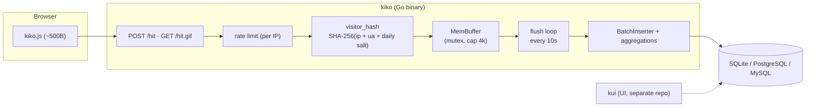

# Kiko — Technical Specifications

> Minimal, privacy-first web analytics collector written in Go.
> No cookies. No Node in production. No bloat.

---

## 1. Philosophy

**kiko** is a privacy-first, lightweight web analytics collector. No cookies, no JavaScript runtime on servers, one static binary.
It follows the same principles as gghstats, kzero, groot, vision:

- **"Boring Hardware"** — predictable, maintainable tools, no magic
- **Single static binary** — pure Go, CGO disabled, distroless
- **Zero Node in production** — no JavaScript runtime on servers
- **Privacy by design** — no cookies, no personal data stored
- **Passes all audits** — govulncheck, grype, gocyclo, cover, go vet, gofmt

The hero banner ([`assets/kiko-hero-full.png`](assets/kiko-hero-full.png), also in [README.md](README.md)) encodes the product thesis: a Go collector scoped to **one job** — gather web analytics on infrastructure you control, without turning visitors into tracking targets.

### 1.1 Design principles

These principles drive implementation choices across the codebase. They are the design intent behind the hero diagram, expressed in engineering terms.

| Principle | Intent | Implementation |
|-----------|--------|----------------|
| **Light and fast** | Minimal client footprint; server tuned for throughput | `kiko.js` (~500B) via `sendBeacon` / pixel fallback; single static Go binary; hot path is validate → hash → append |
| **Privacy by default** | Measurement without surveillance | Cookie-free; `visitor_hash = SHA-256(ip + ua + daily_salt)`; IP never persisted (see [§2.3](#23-privacy-by-design)) |
| **Buffer, then batch** | Decouple ingestion from database I/O | `MemBuffer` (mutex, configurable cap); flush loop every `buffer.flush_interval` seconds; sorted batch inserts + hourly aggregations |
| **Your database, your choice** | Portable storage, operator picks the engine | Same logical schema and flush logic for **SQLite** (default), **PostgreSQL**, and **MySQL** via driver abstraction in `internal/store/` |

**Light and fast.** A ~500-byte tracking script feeds a compact Go binary built for throughput. Inbound hits are validated and hashed quickly — no heavyweight client SDK, no JavaScript runtime on the server. The collector does one thing repeatedly and well: absorb traffic and move on.

**Privacy by default.** The pipeline runs inside a cookie-free boundary. Visitors are ephemeral daily hashes, not persistent profiles; IP addresses exist in memory only for hashing and never reach disk. Analytics you own — not cross-site fingerprinting or third-party surveillance.

**Buffer, then batch.** Hits land in an in-memory buffer first (the "buffered hits" stage in the diagram). On a fixed interval they are sorted, aggregated, and written as organized batch inserts plus hourly rollups. The hot path stays O(1) append; database work is batched and predictable.

**Your database, your choice.** One collector, three backends. Operators choose **SQLite** for zero-config defaults, **PostgreSQL** or **MySQL** for existing infrastructure — same schema, same flush semantics, no application fork.

Together, these define kiko's scope: a robust Go backend dedicated to collecting analytics **sovereignly and respectfully** — not an all-in-one marketing platform, CRM, or tag manager. The **kui** UI (*kiko* + *ui*) is a separate future project; this repo stops at collection, storage, and (Phase 2) the query API kui will consume.

### 1.2 kiko and kui

| Name | Role | Repo | Status |
|------|------|------|--------|
| **kiko** | Metrics **collector** — `kiko.js`, hit ingestion, visitor hashing, in-memory buffer, batch persistence, query API | [github.com/hrodrig/kiko](https://github.com/hrodrig/kiko) | Active (this repo) |
| **kui** | Analytics **UI** — charts, tables, reports over kiko's aggregated stats (*kiko* + *ui*) | [github.com/hrodrig/kui](https://github.com/hrodrig/kui) | Planned |

**kiko** is server-side collection and storage only. It does not ship a dashboard or admin UI.

**kui** is the companion front end. It will read from kiko's REST API (Phase 2) or query the same database in self-hosted stacks. Favicons under [`assets/favicons/`](assets/favicons/) are reserved for kui branding.

The hero banner labels the right-hand browser window "DASHBOARD REPO"; in product terms that slot is **kui**.

---

## 2. Architecture

The architecture diagram below matches the hero banner pipeline: browser → kiko collector (rate limit, hash, buffer, flush) → database → **kui** UI (separate repo, future).



### 2.1 Components

| Component | Description | Language | Status |
|-----------|-------------|----------|--------|
| **kiko** | Collector backend: receives hits, in-memory buffer, batch insert + hourly aggregations, query API (Phase 2) | Go | MVP |
| **kiko.js** | Tracking script (~500B) sending hits via sendBeacon or `` fallback | JS | MVP |
| **kui** | Analytics UI (*kiko* + *ui*). Separate repo. Consumes kiko query API. Charts, tables, reports | [github.com/hrodrig/kui](https://github.com/hrodrig/kui) | Planned |

### 2.2 Hit flow

1. Browser loads `kiko.js` → detects `path`, `referrer`, `title`, `screen.width`
2. Sends `POST /hit` with JSON body via `navigator.sendBeacon()`, fallback to `GET /hit.gif?p=...`
3. **kiko** receives, calculates `visitor_hash = SHA-256(ip + ua + daily_salt)`, appends to memory buffer
4. Every 10s, batch flush: insert raw hits, normalize paths/referrers, upsert hourly stats
5. Always responds with 43-byte transparent GIF (success or error — indistinguishable)

Rate limiting (per-IP token bucket, `golang.org/x/time/rate`) protects tracking endpoints. Health probes and `/kiko.js` are exempt.

### 2.3 Privacy by design

- **No cookies** — tracking via ephemeral `visitor_hash`
- **Daily salt** — hash changes every day, visitor is "new" the next day
- **IP in memory only** — never persisted to disk, only used for the hash
- **No personal data** — no email, name, or persistent identifier stored
- **GDPR-ready** — no cookie banner needed, no PII stored

---

## 3. Database Schema

Default backend is **SQLite** (`./data/kiko.db`). PostgreSQL and MySQL use the same logical schema with driver-specific types.

```sql
-- Raw hits table (append-only)
CREATE TABLE kiko_hits (
    id           BIGSERIAL PRIMARY KEY,
    host         VARCHAR(255) NOT NULL,
    path         TEXT NOT NULL,
    referrer     TEXT,
    visitor_hash CHAR(64) NOT NULL,
    screen_width SMALLINT,
    title        TEXT,
    created_at   TIMESTAMPTZ NOT NULL DEFAULT NOW()
);

CREATE INDEX idx_kiko_hits_host_date ON kiko_hits (host, created_at DESC);

-- Normalized paths
CREATE TABLE kiko_paths (
    id      SERIAL PRIMARY KEY,
    host    VARCHAR(255) NOT NULL,
    path    TEXT NOT NULL,
    title   TEXT,
    UNIQUE(host, path)
);

-- Normalized referrers
CREATE TABLE kiko_refs (
    id       SERIAL PRIMARY KEY,
    host     VARCHAR(255) NOT NULL,
    referrer TEXT NOT NULL,
    UNIQUE(host, referrer)
);

-- Hourly aggregated counts (for fast kui dashboards)
CREATE TABLE kiko_hit_counts (
    host        VARCHAR(255) NOT NULL,
    path_id     INTEGER NOT NULL REFERENCES kiko_paths(id),
    hour        TIMESTAMPTZ NOT NULL,
    total       INTEGER NOT NULL DEFAULT 0,
    uniques     INTEGER NOT NULL DEFAULT 0,
    PRIMARY KEY (host, path_id, hour)
);

-- Hourly referrer counts
CREATE TABLE kiko_ref_counts (
    host        VARCHAR(255) NOT NULL,
    ref_id      INTEGER NOT NULL REFERENCES kiko_refs(id),
    hour        TIMESTAMPTZ NOT NULL,
    total       INTEGER NOT NULL DEFAULT 0,
    PRIMARY KEY (host, ref_id, hour)
);

-- Dedup table for incremental uniques (not exposed via API)
CREATE TABLE kiko_hit_uniques (
    host         VARCHAR(255) NOT NULL,
    path_id      INTEGER NOT NULL REFERENCES kiko_paths(id),
    hour         TIMESTAMPTZ NOT NULL,
    visitor_hash CHAR(64) NOT NULL,
    PRIMARY KEY (host, path_id, hour, visitor_hash)
);
```

**Aggregation strategy:** Within each flush transaction:

1. `INSERT` raw hits into `kiko_hits`
2. Upsert `kiko_paths` / `kiko_refs` (normalize)
3. `INSERT ... ON CONFLICT DO UPDATE SET total = total + N` on `kiko_hit_counts` / `kiko_ref_counts`
4. Insert new `(host, path_id, hour, visitor_hash)` into `kiko_hit_uniques`; increment `uniques` only on first sighting

Pattern inspired by [gghstats](https://github.com/hrodrig/gghstats) `ON CONFLICT` upserts (incremental totals, not GitHub-style `MAX`).

---

## 4. API

### `POST /hit`
Main tracking endpoint.

**Headers:** `Content-Type: application/json`

**Body:**
```json
{
  "host": "gghstats.com",
  "path": "/blog/my-post",
  "referrer": "https://dev.to/someone",
  "title": "My Post | GGHStats",
  "width": 1920
}
```

**Response:** `200 OK` — `Content-Type: image/gif` — 43 bytes transparent GIF.

### `GET /hit.gif`
Fallback for browsers without sendBeacon.

**Query params:** `p`, `r`, `t`, `w`, `h`

**Response:** Same 43-byte GIF.

### `GET /kiko.js`
Serves the tracking script (immutable, cached 24h).

### `GET /api/v1/healthz`
Liveness probe — process up, no dependency checks.

### `GET /api/v1/readyz`
Readiness probe — database ping + buffer stats.

---

## 5. Tracking script (`kiko.js`)

```javascript
// ~500B, zero dependencies
(function(){
  var d = {
    host: location.hostname,
    path: location.pathname + location.search,
    referrer: document.referrer || '',
    title: document.title,
    width: screen.width
  };
  var b = new Blob([JSON.stringify(d)], {type:'application/json'});
  try {
    if (!navigator.sendBeacon('/hit', b)) throw 0;
  } catch(e) {
    (new Image()).src = '/hit.gif?p=' + encodeURIComponent(d.path) +
      '&r=' + encodeURIComponent(d.referrer) +
      '&t=' + encodeURIComponent(d.title) +
      '&w=' + d.width +
      '&h=' + encodeURIComponent(d.host);
  }
})();
```

---

## 6. Tech Stack

| Layer | Technology | Reason |
|-------|-----------|--------|
| Language | **Go 1.26+** | Static binary, ecosystem alignment |
| CLI | **Cobra** | Standard, same pattern as gghstats/kzero/groot |
| Config | **Viper** | YAML + env vars, same pattern |
| DB | **SQLite** (default), **PostgreSQL**, **MySQL** | via `modernc.org/sqlite`, `pgx`, `go-sql-driver/mysql` |
| Buffer | **Memory + mutex** | In-process slice, configurable capacity |
| Rate limit | **golang.org/x/time/rate** | Per-IP token bucket (pattern from gghstats) |
| HTTP | **net/http** stdlib | 3 endpoints, chi is overkill |
| CI | **GitHub Actions** | Same pattern: ci.yml + security.yml + release.yml |
| Release | **GoReleaser** | v2, multi-OS/arch, Homebrew, dockers_v2 |
| Container | **distroless/static** | gcr.io base, nonroot user |
| SBOM | **syft + cosign** | SPDX + CycloneDX, keyless signing |
| Homebrew | **hrodrig/homebrew-kiko** | Separate tap |

---

## 7. Quality Gates

| Gate | Threshold | Where | Blocks |
|------|-----------|-------|--------|
| `gofmt -s` | No diff | `make lint`, CI | ✅ |
| `go vet ./...` | 0 warnings | `make lint`, CI | ✅ |
| `gocyclo -over 14` | ≤14 per function | `make lint`, CI | ✅ |
| `go test -race ./...` | All pass | `make test`, CI | ✅ |
| `go test -coverprofile` | ≥80% | `make cover-check`, CI | ✅ |
| `govulncheck ./...` | "No vulnerabilities" | `make security`, CI | ✅ |
| `grype --fail-on high` | 0 high/critical | `make docker-scan`, CI | ✅ |
| CodeQL | No security alerts | codeql.yml | ✅ |
| VERSION semver | `MAJOR.MINOR.PATCH` | release-check | ✅ |
| Docker running | `docker info` | release-check, docker-* | ✅ |
| HOMEBREW_TAP_TOKEN | set | release.yml | ✅ |

---

## 8. Makefile Targets

```makefile
build         # go build with ldflags (version, commit, date)
install       # go install to $GOBIN
test          # go test -race ./...
cover         # test + coverage.out + report
cover-check   # test + coverage gate ≥80%
lint          # mapstructure pin + gofmt -s + go vet + gocyclo -over 14
lint-fix      # gofmt -s -w
security      # govulncheck + gocyclo + grype
docker-build  # Docker build multi-stage
docker-scan   # docker-build + grype image scan
release-check # lint → test → cover-check → security → docker-scan
release       # release-check + goreleaser (main branch only)
snapshot      # goreleaser snapshot local
port-freebsd-sync   # VERSION → contrib/freebsd/Makefile
port-openbsd-sync   # VERSION → contrib/openbsd/port/Makefile
dist-freebsd  # cross-compile freebsd tarball
dist-openbsd  # cross-compile openbsd tarball
```

---

## 9. Reference Projects

### Direct inspiration

| Project | What to take | What to avoid |
|---------|-------------|---------------|
| **GoatCounter** | In-memory buffer + batch flush, GIF tracking pixel, cookie-less sessions, upsert stats | SQLite bottleneck, jQuery frontend, no horizontal scaling |
| **Pirsch** | Siphash fingerprint (UA+IP+salt+date), worker pipeline channel+batch, zero-allocation UA parser, local channel classification | ClickHouse-only (heavy), no open-source frontend, excessive denormalization |

### Sibling projects (pattern to replicate)

| Project | Key pattern |
|---------|-------------|
| **gghstats** | Makefile with quality gates, GoReleaser v2, distroless Docker, BSD ports sync, release-check gate |
| **kzero** | gocyclo ≤14, coverage 80%, security meta-target, cross-compile 5 OS × 2 arch |
| **groot** | Same structure: cmd/ + internal/, VERSION file, codecov.yml, man page in contrib/ |

---

## 10. Supported Platforms

| OS | Arch | Format |
|----|------|--------|
| Linux | amd64, arm64 | tar.gz, .deb, .rpm, Docker |
| macOS | amd64, arm64 | tar.gz, Homebrew |
| Windows | amd64, arm64 | zip |
| FreeBSD | amd64, arm64 | tar.gz, port |
| OpenBSD | amd64, arm64 | tar.gz, port |
